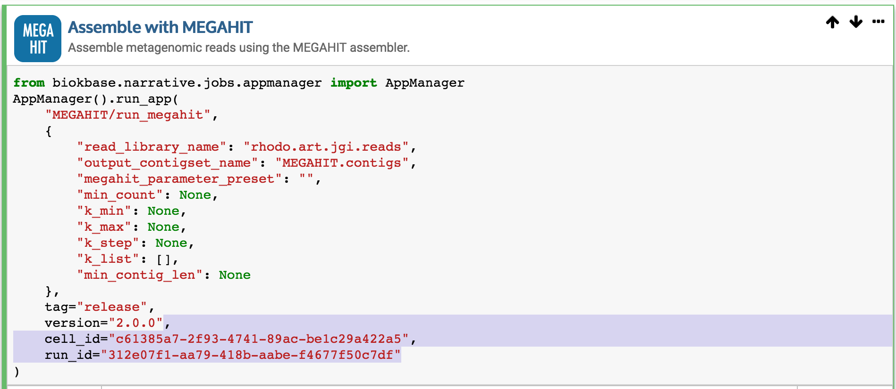
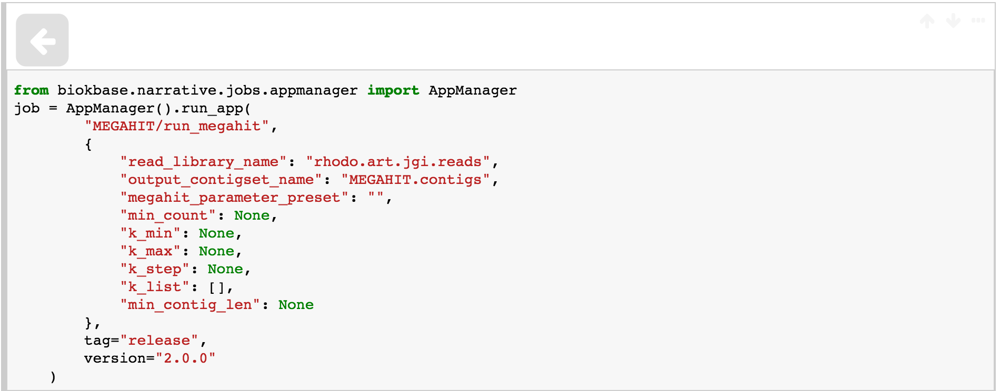
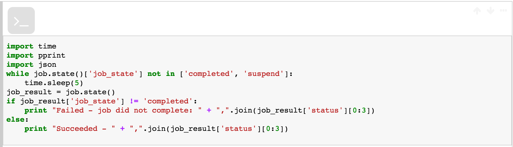
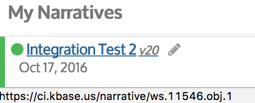

# Headless Narrative Testing

Headless testing refers to running a narrative without a browser. This can be used for
testing that narratives run properly after changes to either the narrative itself
or to narrative apps.

Because the narratives are being run without a browser front end, there are certain
caveats:

* Credentials must be passed into the container via environment variables
* Narrative cells are run sequentially, non-interactively. So narratives that depend
on user interaction to run the next cell in sequence after the job runner shows that
the app cell as completed will not function properly.
* App Cells typically run asynchronously, and will return immediately upon submitting
the job request, passing the job handle information via the messaging system to the
job manager. The underlying code cells must be modified to return the job handle,
and then a separate code cell must be written that polls the job status and fetches
the final job state.
* Because we are running in a command line environment, the default output is what
is sent to stdout in the last code cell that runs. The narratives being run must
print something that can be meaningfully parsed from stdout

## Example Narrative conversion

It is relatively straightforward to convert a narrative to be _headless friendly_. Here
is an example of a normal App Cell based narrative that runs the Megahit app:

Here is the underlying code cell, notice the 2 parameters that are highlighted:

When cell_id and run_id are passed to the AppManager, the AppManager launches the job
request and then passes the job handle information to the messaging system, which passes
it to the browser job manager. The call to run_app also returns without any useful
return value. By removing those 2 parameters, the run_app call will return a job handle
that can be monitored for job state. Here is the cell after removing those 2 parameters
and assigning the return value to a job state variable:

The next cell will poll the job state and then perform a very simplistic check to see
if it ran to completion:

The complete testing narrative is simply these 2 cells in sequence:

You can see this test narrative in the KBase CI environment at this URL:
https://ci.kbase.us/narrative/ws.11546.obj.1

## Running Headless Narratives

The standard narrative container now contains an additional executable in /usr/bin called
"headless-narrative". It is installed by the install_narrative_docker.sh script using
the run_headless.tmpl file. To run this script, simply run the narrative docker container
but override the default entrypoint with "headless-narrative".

You will need to pass in the following environment variables via -e parameters on the
docker run command line:
* KB_AUTH_TOKEN - this is a standard KBase authentication token with access to the narrative to be run
* KB_WORKSPACE_ID - this is a workspace that the KB_AUTH_TOKEN has access to. A narrative needs to run within some
workspace. This can be the same as the workspace of the narrative being run, or another workspace that the token has access to
* SERVICESSL - [optional] this is the SSL endpoint for API services that distinguishes CI, next, appdev or production. At runtime this
is substituted into the endpoints preconfigured for the narrative container

The [__main__ routine](../src/biokbase/narrative/exporter/run_narrative.py#L126) that runs the
narrative accepts some commandline parameters:

* **--all** display the output from all code cells that have run, not just the final one
* **--codecells** display the code cells as well as the output from the code cells

The parameter that is passed to the headless-narrative route is the workspace ID of the
narrative to run, in the form of the numeric workspace ID in the format ws_id/obj_id/version_id.
All of the numeric portions can be found from the Narrative GUI by looking at the lefthand
data panel. The workspace ID and object ID are part of the URL for the narrative, and
come up when you mouse over a narrative in the data panel:

 In the image above, you cannot see the cursor, but it is hovering above the "Integration Test 2" v20
 narrative. The string at the bottom of the window shows that the Integration Test 2 narrative is
 object 1 in workspace 11546. To run this narrative you would pass the argument 11546/1/20 to the
 headless-narrative script.

 Here is an example of running that narrative in the default (CI) environment:
 ~~~
 (narrative) 177:narrative sychan$ docker run -i -t \
> -e "KB_AUTH_TOKEN=un=sychan|tokenid=...secret_squirrel_decoder_string..." \
> -e "KB_WORKSPACE_ID=sychan:1474590456472" \
> --entrypoint="headless-narrative" \
kbase/narrative:latest 11546/1/20
Configuring KBase logging from defaults (KBASE_PROXY_CONFIG is empty, or not found)
'Succeeded - 2016-10-18T03:57:56+0000,complete,done\n'
(narrative) 177:narrative sychan$ 
~~~

Here is an example of setting the environment to the AppDev environment and then running a
[very simple narrative](https://appdev.kbase.us/narrative/ws.2012.obj.1):
~~~
(narrative) 177:narrative sychan$ docker run -i -t \
> -e "KB_AUTH_TOKEN=un=sychan|tokenid=...secret_squirrel_decoder_string..." \
> -e "KB_WORKSPACE_ID=sychan:1474590456472" \
> -e "SERVICESSL=appdev.kbase.us" \
> --entrypoint="headless-narrative" kbase/narrative:latest 2012/1/4
Configuring KBase logging from defaults (KBASE_PROXY_CONFIG is empty, or not found)
"I'm running in appdev\n"
(narrative) 177:narrative sychan$
~~~

Here we run the first narrative, but displaying all the codecells as well as the outputs:
~~~
docker run -i -t \
> -e "KB_AUTH_TOKEN=un=sychan|tokenid=...blahblahblah..." \
> -e "KB_WORKSPACE_ID=sychan:1474590456472" \
> --entrypoint="headless-narrative" \
kbase/narrative:latest --codecells --all 11546/1/20
Configuring KBase logging from defaults (KBASE_PROXY_CONFIG is empty, or not found)
from biokbase.narrative.jobs.appmanager import AppManager
job = AppManager().run_app(
        "MEGAHIT/run_megahit",
        {
            "read_library_name": "rhodo.art.jgi.reads",
            "output_contigset_name": "MEGAHIT.contigs",
            "megahit_parameter_preset": "",
            "min_count": None,
            "k_min": None,
            "k_max": None,
            "k_step": None,
            "k_list": [],
            "min_contig_len": None
        },
        tag="release",
        version="2.0.0"
    )
{u'attributes': {u'lastLoaded': u'Tue, 18 Oct 2016 00:36:51 GMT'},
 u'jobId': u'57e4a2bae4b0b05cf8996b38',
 u'state': {u'awe_job_id': u'97c80439-3abd-4479-ab31-5ffb0196a010',
            u'canceled': 0,
            u'cell_id': None,
            u'creation_time': 1474601658985,
            u'exec_start_time': 1474601667235,
            u'finish_time': 1474601727603,
            u'finished': 1,
            u'job_id': u'57e4a2bae4b0b05cf8996b38',
            u'job_state': u'completed',
            u'result': [{u'report_name': u'report_6fbf48d3-ba98-4f0b-9db2-ae3ac1d8cfad',
                         u'report_ref': u'11546/8/1'}],
            u'run_id': None,
            u'status': [u'2016-09-23T03:35:27+0000',
                        u'complete',
                        u'done',
                        None,
                        None,
                        1,
                        0],
            u'ujs_url': u'https://ci.kbase.us/services/userandjobstate/'},
 u'type': u'output'}

import time
import pprint
import json
while job.state()['job_state'] not in ['completed', 'suspend']:
    time.sleep(5)
job_result = job.state()
if job_result['job_state'] != 'completed':
    print "Failed - job did not complete: " + ",".join(job_result['status'][0:3])
else:
    print "Succeeded - " + ",".join(job_result['status'][0:3])

'Succeeded - 2016-10-18T06:41:59+0000,complete,done\n'

(narrative) 177:src sychan$ 
~~~

