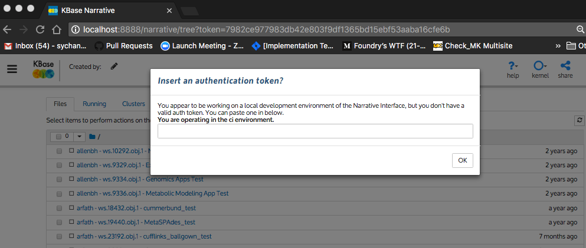
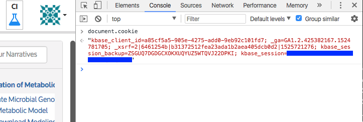
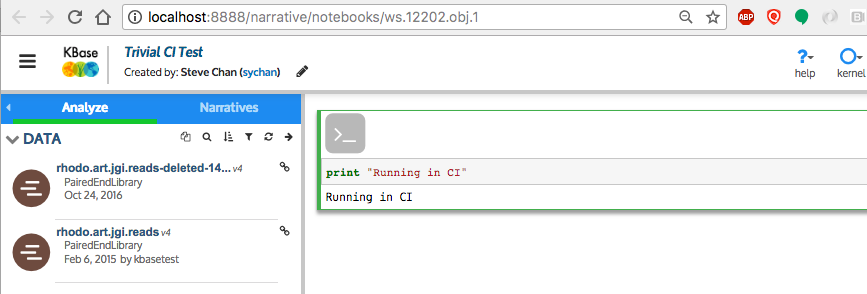
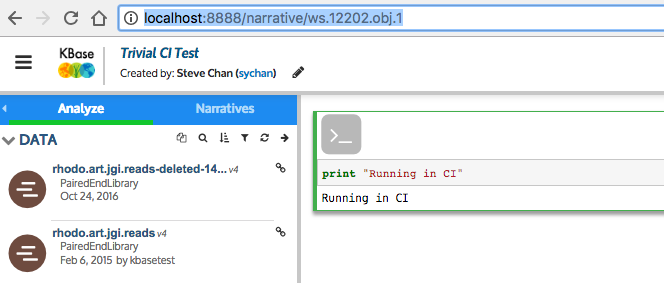

## Building Narrative Images with Dockerhub
(Updated 6/1/2018)

We currently make use of Travis and Dockerhub (https://hub.docker.com) to manage Narrative production builds. There are three images here that stack on each other.

### List of images
1. **kbase/kb_python:latest**
This is currently a Debian 9 image built using Conda to support Python2 and Python3. It includes the basic requirements for a KBase core python service to run, such as KBase libraries for authentication, workspace, core services, etc... The repo for this is at https://github.com/kbase/kb_python and it is built automatically via dockerhub build hooks and pushed into dockerhub. If you do not have this on your local docker host running "docker pull kbase/kb_python:latest" will pull it down from dockerhub. With the proviso that a travis build+push takes some time, the dockerhub image should always track the github repo description.

2. **narrbase**
This image is the base for the KBase Narrative code. It builds on kb_python by using Conda to install specific versions of R, NodeJS, Jupyter, IPython, and IPywidgets. Basically this is an image that run a Jupyter notebook with support for R, NumPy, Pandas, etc... This layer allows us to manage versions of those components without rebuilding everything in kb_python. The Dockerfile for this image can be found under the narrbase-image directory. For local builds, this image should persist on the developer's machine, speeding up building/testing of narrative changes.

3. **narrative**
This is the final image containing the Narrative. It contains the actual Narrative codebase that runs on top of the Jupyter environment in narrbase. There is a travis/github connector that triggers a Travis CI build/test/publish job based on the configuration in travis.yml. If the regression tests succeed then the Narrative image is built and pushed into dockerhub. This image is suitable to be run on a developer's local machine, or the KBase CI, AppDev, Next or Prod environments, depending on environment variables passed in at container runtime.

4. **narrative_version**
This is a very small container who's sole purpose is to serve a JSON file containing the version number of the most recently deployed narrative. This version number is used by narratives to notify the user that there is a newer release of the narrative and that they should restart their narrative to picking the latest build. This image is currently 15.5mb in size, running nginx in alpine linux, serving a single file. This was created as an interim step between copying files from the narrative image into the kbase-ui image (the past practice) and having the narrative register the most recent narrative version with the narrative method service (the future state). This image is intended to be made available via the nginx services as something like /services/narrative_version with only the the URL /services/narrative_version/narrative_version returning any content. The narrative container is configured via the VERSION_CHECK environment variable to look at that URL.

### How to build images
Travis-CI is used to run regression testing on the branches declared in the branches stanza of the top level travis.yml file. Currently the travis file builds on these branches:
~~~
branches:
  only:
    - develop
    - master
    - travis-firefox
    - dockerize
~~~
If the regression tests complete, then docker images are built and pushed into Dockerhub as kbase/narrative:$TAG and kbase/narrative_version:$TAG where $TAG corresponds to the the branch ("latest" is substituted for master)

These images can be built locally and run using the docker_image Make target. The narrative image can then be run locally using Docker, with the CONFIG_ENV environment variable used to tell the narrative which stanza of the config.json file to use for service endpoints. This is implemented through a golang text/template in the src/config.json.templ file, which is rendered by the entrypoint dockerize program into src/config.json.

As an example, the following docker command will bring up a narrative container configured to use CI service endpoints:
~~~
docker run -it -e CONFIG_ENV=ci -e VERSION_CHECK=https://narrative.kbase.us/narrative_version -p 8888:8888 kbase/narrative:dockerize
2018/06/01 21:46:53 Setting effective gid to 65534
2018/06/01 21:46:53 Setting effective uid to 65534
No handlers could be found for logger "tornado.application"
[W 21:46:54.621 NotebookApp] server_extensions is deprecated, use nbserver_extensions
[I 21:46:54.671 NotebookApp] Writing notebook server cookie secret to /tmp/notebook_cookie
[W 21:46:54.695 NotebookApp] WARNING: The notebook server is listening on all IP addresses and not using encryption. This is not recommended.
[I 21:46:54.711 NotebookApp] Workspace Narrative Service with workspace endpoint at https://ci.kbase.us/services/ws
[I 21:46:54.712 NotebookApp] 0 active kernels
[I 21:46:54.712 NotebookApp] The Jupyter Notebook is running at:
[I 21:46:54.712 NotebookApp] http://[all ip addresses on your system]:8888/narrative/?token=7982ce977983db42e803f9df1365bd15ebf53aaba16cfe6b
[I 21:46:54.712 NotebookApp] Use Control-C to stop this server and shut down all kernels (twice to skip confirmation).
[C 21:46:54.713 NotebookApp]

    Copy/paste this URL into your browser when you connect for the first time,
    to login with a token:
        http://localhost:8888/narrative/?token=7982ce977983db42e803f9df1365bd15ebf53aaba16cfe6b
~~~

At this point if you point your browser at the URL provided, you should see the following dialog box:

Enter a valid KBase auth2 token for the CI environment. If you bring up an narrative in the CI environment and use the developer Javascript console to display the contents of the document.cookie, the value assigned to kbase_session can be cut and pasted into the modal dialog to give this narrative authenticated access. In the following screenshot the string containing the token is blocked out with a bright blue line to identify where you can find the token in your local environment:

Once you have entered a valid token, you should be able to use the narrative in that environment.

Another issue to note is that by default, when you click on a narrative to open it, the URL will be of the form localhost:8888/narrative/*notebooks*/ws.####.obj.1 (see the example in the URL bar of the screenshot below)

The "/notebooks/" component in the path will cause problems with using the notebook, and it is best to connect to the Jupyter server using a path without the "/notebooks/" component, in this example screenshot we change it from *http://localhost:8888/narrative/notebooks/ws.12202.obj.1* to *http://localhost:8888/narrative/ws.12202.obj.1*

### How to update the Dockerfiles

The Narrative Dockerfiles are nested in a short chain.
**kbase/kb_python:latest** represents the KBase Python environment and should probably not be updated without approval.

**kbase/narrbase:<version>** is the base image for the Narrative. Updating this might be necessary to update versions of different components, or add new components that should be available in the Narrative interface.
This is done in a few steps.

1. Add requested changes to `narrbase-image/Dockerfile`, or an appropriate file in the `narrbase-image/conda-requirements/` directory. E.g. for adding more R packages, update `narrbase-image/conda-requirements/r.conda-forge`.
2. Update the narrbase image version. This is in `build_narrative_container.sh` as the `NAR_BASE_VER` variable, which is used to build the narrbase image. When the final image is built for the Narrative it uses the `Dockerfile` in the root of this repo - update the `FROM` line there to match the new version.
3. Build and test locally - recommended. Build this using the instructions above (`make docker_image`).
4. Submit a pull request. This will build the new image and store it in Dockerhub.

**kbase/narrative:latest** is the final image for the Narrative. Update this by altering the Dockerfile, or just adding new code. It's recommended that any new Python packages - especially those that make use of scientific tools like Numpy or Scipy, or really any that have dependencies on what is already loaded via the base image - be added to the base image. The reason for this is that (as of 8/31/2018) the base image uses Conda to install dependencies, but the Narrative itself uses pip, which can cause conflicts. An upcoming update will address this.