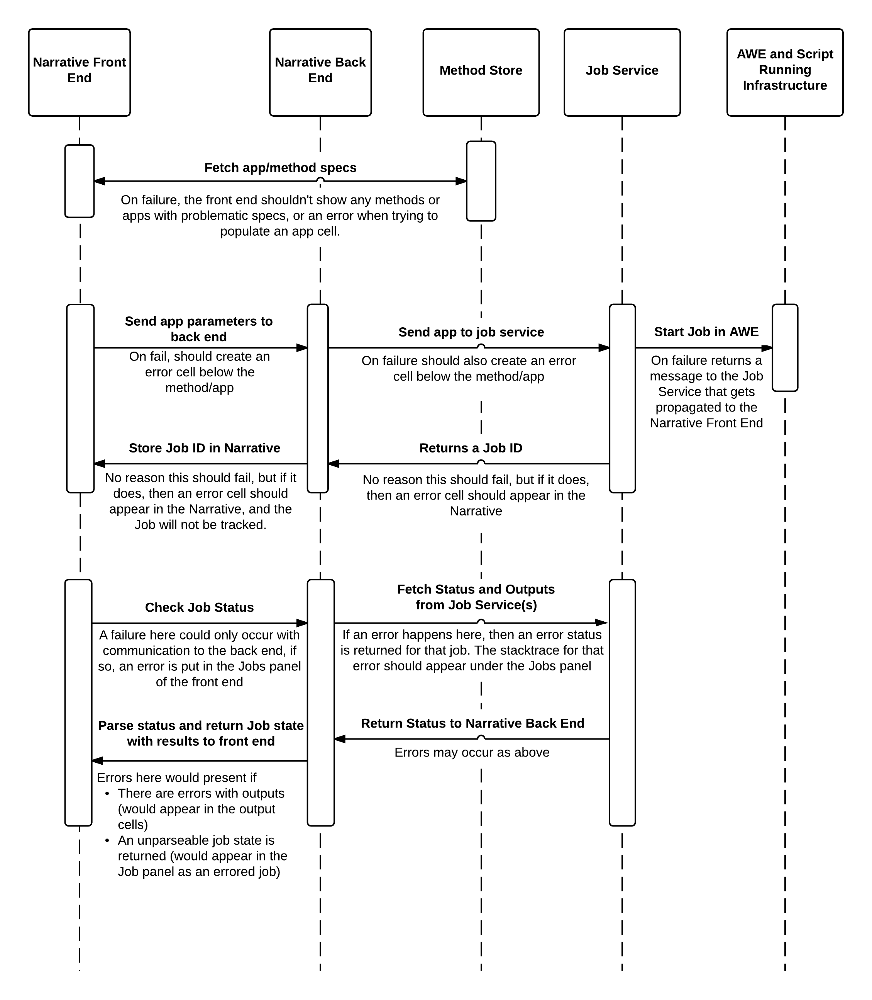

#Narrative app error conditions
###Bill Riehl <wjriehl@lbl.gov>
###Last update - January 9, 2015

There have been some issues with development and debugging apps and methods in the Narrative. Here, I put together a few tips on where the possible points of failure are and how to try to debug each one. I'm attaching an image that details all the moving parts where errors could occur, and what kind of behavior those errors should cause. If any conditions arise that aren't covered here, then that could be a bug that needs to be dealt with. Please submit a JIRA ticket!

There are four main steps that occur over this whole app/method running process:

  1. Narrative fetches the list of specs
  2. User selects an app, enters parameters, and runs it
  3. Narrative checks job status
  4. Narrative displays results

**General overview of possible points of failure**: 

Most errors that we've come across so far have been in the specs themselves, so I'll start with describing that process.

**1. Narrative fetches the list of specs**

At page load time, the Narrative fetches the specs of all apps and methods from the Method Store, and populates its list with that info. Because of how the fetching works (as of this afternoon when a new deployment is done), if a spec has an error, it will not appear in the list of available methods.

So, if your method or app doesn't appear in the list, and you think it should, you can try to fetch it manually using the method store client library. From within the Narrative you can open a code cell (click the 'Code Cell' button under the Methods Panel) and set up a method store client:

    from biokbase.narrative_method_store.client import NarrativeMethodStore
    nmsClient = NarrativeMethodStore(url="https://kbase.us/services/narrative_method_store/rpc")

This URL is the endpoint for the production method store, if you're checking against the sandbox method store, use:

    https://narrative-sandbox.kbase.us/services/narrative_method_store/rpc

Now, you can fetch your method or app spec directly:

    nmsClient.get_app_spec({"ids": ["my_app_id"]})

This should return a JSON object with your app spec, or an error with a (hopefully!) useful message.

**working example**:

**error example**:

Most of the rest of the potential errors should show themselves in the Narrative itself as either error cells that occur at App/Method runtime, or as errors in running jobs. I'll outline these below.

**2. User selects an app, enters parameters, and runs it**

Once an app's parameters are filled out and submitted, three things occur:

  - The front end packages that info and sends it to the back end where it is logged.
    - If an error occurs here, it should pop up immediately in an error cell below the app or method.
  - The back end formats this info into a Job Service call and fires it off, getting a job id.
    - If an error occurs here, it should also appear in an error cell below the app or method.
  - The job id is propagated to the front end where it is stored in the Narrative document and used to periodically check the status.
    - If an error occurs here, then the job id isn't stored, an an error cell should also appear.

Basically, if an error occurs between filling in the app's parameters and sending it to the Job Service, it should pop up in the Narrative window pretty quickly.

At this point, a developer can also get the document that was sent to the job service by selecting 'View Job Submission' from the app cell's menu in its upper-right corner. This will print out a JSON object (and also embed it in a job_info variable) with three main properties.

  - 'app' is the information submitted to the job service
  - 'app_state' is the initial state returned from the job service
  - 'job_id' is the job id that's registered with the Narrative (a prefix is used to tell the source of that job, since we're not consolidated yet)

**View Job Info example**:

**3. Narrative checks job status**

While a job runs, the Jobs panel periodically checks the job's state as follows (with potential points of failure inline):

  - The Narrative sends job info to the kernel to be checked
    - If an error occurs with this communication, the Jobs panel will show the error and traceback.
  - The kernel fetches Job status and results from the Job service
    - Errors here are propagated forward as errors in the job itself. 
    - If there is an error with some particular step of the app, but the whole job is not in an error state, then there will be a little /!\ icon. Clicking on this will give error details.
    - If there was an overall error either with the job, or while fetching that job's info, then the whole job field will be shaded red and a red error button will be visible. Clicking that will give error details.
  - The kernel parses these job statuses and results into a form readable by the Narrative, and pushes them to the front end.
    - Errors here result in a job in an error state with some message.

**4. Narrative displays results**

Once a job finishes, it should display its results. Those results get returned back as part of the job status packet, using the mapping given in the "output mapping" field of the spec. The output widget there is expected to be the "name" field in the widget itself, i.e., how you would actually invoke the widget in the page - NOT its file name.

Errors here could occur if:

  - The output widget expects some fields, but receives others.
  - The output widget code contains bugs that prevent rendering.